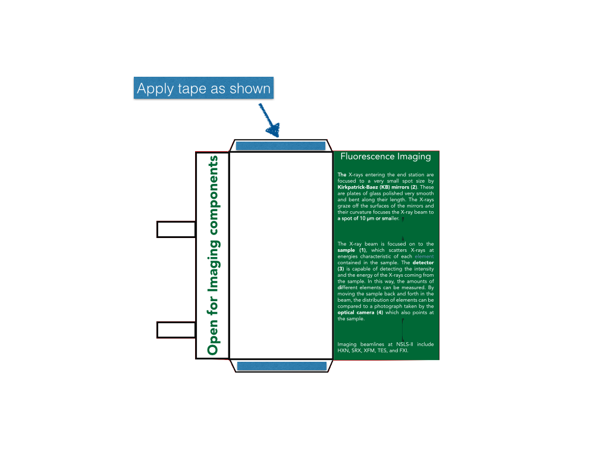
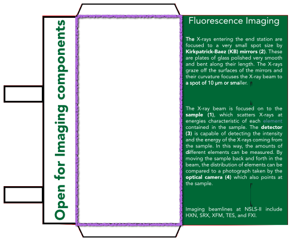
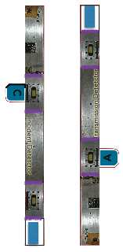
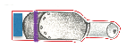
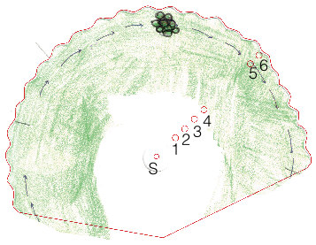
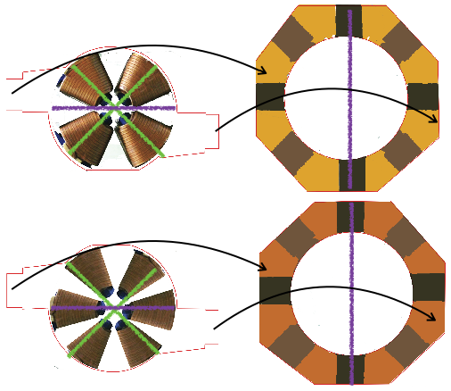
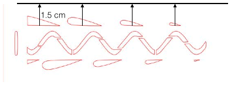
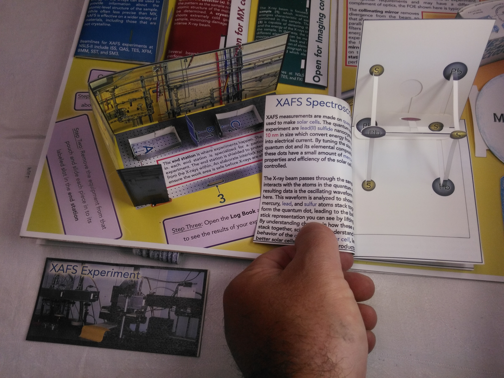
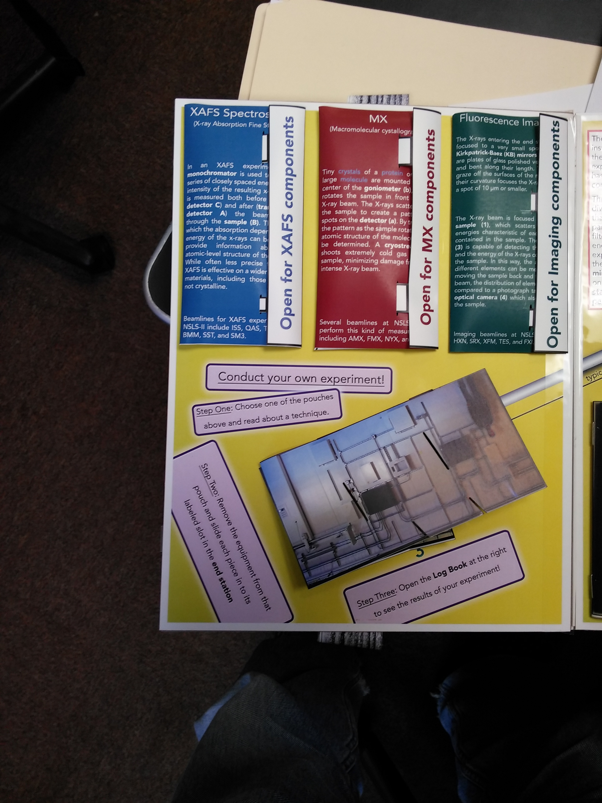
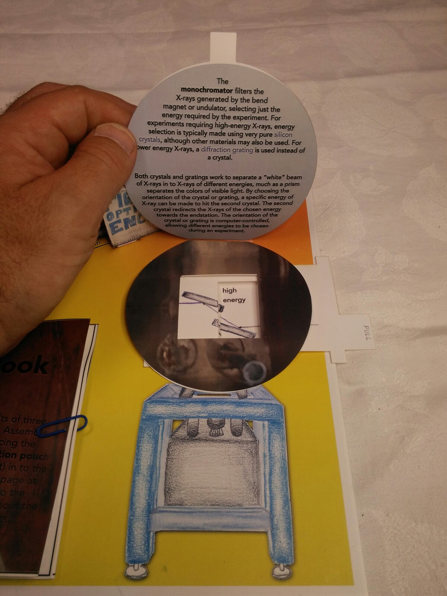

Build instructions
==================

Note: This is a craft project, not a simple "some assembly required" toy. Think about what you're doing as you make the book, and expect to have improvise a little at times. You may well think of a better way of doing some of these steps than what we've suggested. If so, let us know by raising an issue at the GitHub site -- maybe we'll incorporate it in to a new set of instructions!

The [walkthrough](https://github.com/bruceravel/synchrotron_pop_up_book/blob/master/walkthrough.md) can also be helpful for seeing what the assembled components look like.

# Preliminaries
## Step 1

Gather [materials](https://github.com/bruceravel/synchrotron_pop_up_book/blob/master/materials.md).

## Step 2

Download [pdf files](https://github.com/bruceravel/synchrotron_pop_up_book/blob/master/pages.md) for the individual pages.

## Step 3

Print. The inserts and front and back cover may be printed on regular paper if desired. The "Acetate page" must be printed on transparency film. Other components should be printed on tear-resistant paper or cardstock. 

Note: some of the pages have two sides, with one file for each side. It is impossible, with any ordinary kind of printer, to ensure perfect alignment when printing two-sided (we tried!). But you should try to get the alignment as good as you can. This usually involves putting a single sheet in the paper tray or feeder, pushed all the way up against the guides on one side (in most printers, there's a little wiggle room), printing one side, and then putting the printed page back in the paper tray/feeder, pushed up against the same guides, and printing the second side.

# Note on Cutting

At some point, you will need to cut out the components for the book, and also cut several slits in the pages. The red lines show you where to cut when it is not obvious.

One good way to make the cuts is to use a utility/hobby knife, or a razor blade. Scissors are not recommended--it's hard, for example, to cut the slits that way. If you have an automatic cutter of some kind, such as are sold for scrapbooking, you can download the [photoshop files](https://github.com/bruceravel/synchrotron_pop_up_book/blob/master/photoshop.md) and use the cut lines layer to create a template for your cutter.

If you are using a knife or razor blade, we recommend cutting as you go, rather than doing all the cutting first. The instructions below sometimes mention subtleties in how to make the cuts that you might miss otherwise, and it also becomes easy to confuse components such as the different sections of wall.

# Note on Tape

If you're using the suggested tape from the materials page, you don't need a scissors to cut off strips--you can tear it with your fingers.

# Components for Experiments

The first thing to assemble is the components for the experiments that will go in the endstation, and the pouches to hold them.

## Step 4

Each of the "pouches" sheet has a piece that will form a pouch when cut out and folded--they take up about half the page, and have "Open for...components" on the left flap. One is blue, one is red, and one is green. 

Cut around the outside of these shapes to remove them from their sheets.

## Step 5

Note that each pouch also has two tall narrow ovals, in black, inside the colored rectangle with the text. Cut a slit inside each of these ovals. It is not necessary for the slit to be perfect--you don't need to cut out the entire oval to its border, for example. It just needs to be wide enough to fit the tabs at the left side.

## Step 6

For each pouch, tear off two strips of tape about the length of the small trapezoidal tabs and apply them. For now, don't take the backing off.

## Step 7

For each pouch, fold away from you along the lines shown in purple below. This should create an envelope with the writing on the outside.

## Step 8

Remove the backing from the strips of tape, and seal the front of the pouch to the tabs.

You should now have three pouches. Each can be open and closed repeatedly by inserting the small rectangular tabs in to the slits you made.

## Step 9

Cut the individual cards out of the "Inserts" page. Slide each one in to the pouch with the matching label.

## Step 10

In the next several steps, we're going to make several of the experimental components that go in the pouches. Cut out the following:

* From the One-Sided Components page, the KB Mirrors and the Detector.
* From the Two-Sided Components page, the Silicon Drift Detector, the plant, the solar cell sample, the Optical Camera (labelled 4), and the Goniometer head (the small, grey, unlabeled piece in the lower left).
* From the page that held the imaging pouch, the Goniometer base (labelled b).
* From the Inner Wall page, the Cryostream.
* From the Spinner page, the Incident Detector and Transmission Detector.

## Step 11

Fold the tab on the plant toward you, and slide the plant in to the green pouch. Fold the tab on the solar cell sample toward you, and slide in to the blue pouch.

## Step 12

The Cryostream and the Optical Camera have a diagonal line to mark where a slit should be. Cut each slit, extended it all the way to the edge.

The Cryostream can now be slid in to the red pouch and the Optical Camera in to the green pouch.

## Step 13

The KB Mirrors, the Detector, and the Silicon Drift Detector are assembled similarly. In each case, there is a small rectangle at one end, about the width of a strip of tape. Place a piece of tape along that length. Next, fold away from you along each of the parallel rectangle sides, so that the object forms a box, with the rectangle with the tape overlapping the bottom of the opposite side. Remove the backing from the tape and press against the overlapping side. Manipulate the resulting box so that the sides are perpendicular. Do not fold the tabs!

Slide the KB Mirrors and the Silicon Drift Detector in to the green pouch and the Detector in to the red pouch. You'll have to flatten them a bit to do that.

## Step 14

The Incident Detector and Transmission Detector are assembled similarly. Place a piece of tape in the empty rectangle as shown. Fold away from you along each line shown, to form a box. Remove the backing from the piece of tape and attach it to the overlapping side. Manipulate the resulting box so that the sides are perpendicular. Fold the tab so that it points out from the box.

Slide the Incident Detector and the Transmission Detector in to the blue pouch. You'll have to flatten them a bit to do that.

## Step 15

Place a piece of tape along the Goniometer head as shown. Then fold away from you along the line shown (the exact location of the fold isn't crucial).

Remove the backing from the tape and attach to the center of the Goniometer base. It doesn't matter which way you orient it, but you should manipulate the fold so that the goniometer head is sticking straight out of the base.

Place the assembled goniometer in to the red pouch.

## Step 16

Close each of the pouches by slipping the tabs in to the slits, and set aside.

# Bend Magnet Spinner

## Step 17

Cut out the remaining pieces from the Spinner page. The scalloped edges of the spinner are not crucial to its function; spend as much or as little effort as you'd like getting those cut prettily!

Note the red oval in the top bend magnet (shown in blue). Cut a slit in that red oval.

Note the red circles in the spinner. Find a way to make each in to a hole. Maybe you can do that with a knife or razor, or maybe it's better to use a needle--let us know what works well for you! (We used a laser cutter for all the cuts in the book, so haven't experimented much with other methods.) Do not make the holes bigger than the circles.

## Step 18

Thread an ordinary round toothpick through the spinner. Using the numbering shown on the figure below, start with the toothpick on the printed side of the spinner, and then push it through hole 1, back out hole 2, in hole 3, and so on. It should fit snugly. If it doesn't, tape or glue it in place, but don't use any tape or glue between hole 4 and hole 5.

## Step 19

Print Page 1. Note there is a small red circle in the lower left and two red ovals a little right of the center. Make a hole through the circle, and cut a slit inside each oval.

## Step 20

Take one of the small screws, and pass it through hole S in the spinner and then through the hole in page 1 and in to a matching nut. Tighten enough to hold in place, but not so tight that the spinner can't be turned.

## Step 21

Take the X-ray arrow from the Spinner page, and apply a small piece of tape opposite the end with the arrowhead. Slip the arrow through the slit in the blue bend magnet (not the slit in Page 1!) so that the arrowhead is visible in front of the bend magnet and pointing to the right. Take the other end (which has tape on it, right?) and wrap it around the toothpick (which is threaded through the spinner) somewhere between hole 4 and 5. Remove the backing from the tape and attach the end of the arrow to itself, forming a small loop around the toothpick. The idea is that the arrow should be able to slide freely up and down the toothpick between holes 4 and 5.

You should now have a multi-layered assembly. From front to back, you should have the arrowhead, the bend magnets, the tail of the arrow (wrapped around the toothpick), the spinner, and then Page 1. 

## Step 22

Use tape to attach the piece with the bend magnets to Page 1. Because the spinner will be in the way of much of it, those tapes will be limited to a few places on the outer edges of the back of the piece with the bend magnets. In addition, don't use any tape in the top left quadrant except for one piece at the edge of the page, since the toothpick will need to be able to spin freely in that area. 

The result should be that you can turn the spinner using the window in the bend magnet piece at the left, and as you do so the x-ray arrow moves further in or out of the bend magnet. The toothpick should not be visible, and the range of rotation should be limited by a piece of tape so that the toothpick cannot be rotated in to the window.

There's all sorts of places where something could get stuck here--this is one of the places where it's handy to be able to remove the tape from the tear-free paper! Work at it until you're satisfied.

# Shaping Magnets

## Step 23

From the Magnets page, cut out the quadrupole magnet, the sextupole magnet, and the two magnet frames. The quadrupole magnet is the thing with the four copper coils, the sextupole the one with the six coils, and the frames are the colored octagons.

Cut out the white area from the center of the frames.

## Step 24

Put a small piece of tape on the end of each tab sticking out from the magnets, on the **non-printed** side of the paper.

## Step 25

For each magnet, fold it toward you along one of the green lines shown below. Then unfold and fold toward you along the other green line. Unfold again, and then fold away from you along the purple line.

Fold the frames away from you along the purple lines (i.e. fold them in half).

## Step 26

The yellow frame is for the quadrupole magnet and the orange frame for the sextupole (this is the same color scheme used for the actual magnets at the NSLS-II!).

Remove the backing from the pieces of tape. With the magnet and the corresponding frame both printed side up, place the magnet behind the corresponding frame, so that it's visible through the hole in the middle of the frame. This next step is magic, so read it carefully: attach the tape on the magnet tab to the **non-printed** side of the frame, approximately where the arrows in the diagram above show, so that the small rectangle at the end of the tab just overlaps the frame. 

If you've done everything right, the entire assembly can be squashed flat so that the magnets show nicely through the hole in the frame, but the assembly can also be folded in half, as shown in the animation below.

## Step 27

Cut out the two large rectangular pieces from the text and cover pages. Do not cut out the circle in the middle of the small depictions of the frames!

## Step 28

One side of one of the pieces has text that starts with "As the electron bunches travel..." Place a piece of tape along the tall narrow rectangle next that's to the right of the square which contains that text.

## Step 29

While looking at the piece with the tape on it, fold toward you along the line between the square with the text and the rectangle with the tape.

Fold the other rectangular piece in half, so that it forms a booklet with "A quadrupole magnet by itself..." on the left inside page, "To correct this problem..." on the right inside page, and "A quadrupole magnet has four powerful magnets..." on the front. The back will be blank.

## Step 30

Remove the backing from the tape. Place that  piece so that the large square photograph is on top of the booklet and the small rectangle wraps around it. Press to seal them together with the tape and form a new booklet. The sequence of pages should be the large photograph as a cover, then "As the electron bunches travel," "A quadrupole magnet has four powerful magnets," "A quadrupole magnet by itself," and "To correct this problem."

## Step 31

Because of how they've been folded, each magnet now has been divided in to two large triangular regions opposite each other, and four small ones, which all come together in a point in the center.

Place some tape on the non-printed side of each large triangle. What's "some" tape? Perhaps three pieces roughly outlining the outside of each triangle, but you don't need to be picky.

## Step 32

Open the booklet to the first pair of pages, about the quadrupole magnet. Remove the backing on the tapes on the quadrupole magnet. Center it, with the line between the small triangles pointing along the fold in the page, so that one of the large triangles is attached to the left page, and one to the right. Press down to seal.

Turn the page, and repeat the process for the sextupole magnet.

## Step 33

At first the booklet will be a little hard to close--don't be afraid to press on it a bit to reinforce the folds in the magnets. 

Use a paperclip to hold the book shut (it will bulge--that's OK). Set the book aside.

# Undulator

This is one of the most finicky and precise assembly sequences required for the book. If you have more than one person working on this project, the one who is better with precise craft work should do this part.

## Step 34

Cut the piece that says "pull" out of the Acetate page (the "slider") and the large plain rectangular item with no writing on it (the "sleeve") from the One-Sided Components page.

## Step 35

Place a strip of tape along each long edge of the sleeve. Make sure the tape doesn't hang over the edge, though.

## Step 36

Fold away from you along the lines. If you turn the sleeve over, and push the folded sections nearly flat against the rest of it, you should now have a kind of frame that the slider can slide through. Check the fit--the piece should slide back and forth comfortably, but not have too much room to wiggle from side to side. If it doesn't, adjust the folds you made accordingly. Remove the slider so it doesn't get damaged in the subsequent steps; you'll reinsert it later.

## Step 37

Print page 2. Notice there are two red ovals near the center of the page. Cut a slit in each.

There is also an intricate design in red in the lower right-hand corner. Cut out that design.

There is another red oval just to the right of the design. It is difficult to see in the foliage, but look carefully and you'll find it. Cut a slit in that oval. (If it's still hard for you to find that oval, look at the illustration of the back of the page shown under Step 39.)

## Step 38

Flip over page 2 to the non-printed side. With a ruler, measure 1.5 cm from the bottom edge of the top row of cut-outs and use a pencil to mark a line. The figure below shows where to measure from, and the line (in black) that you should mark.

## Step 39

At one end of the sleeve, put a piece of tape along one of the short sides. It should be long enough to go under both overhangs. Removde the backing, and seal the overhangs to the main piece on that end. This will create a stop, so that if you put the slider back in the sleeve with the wide end pointing toward the tape, it won't be able to move past it. But don't do that yet.

## Step 40

Remove the backing on the long pieces of tape that you applied to the overhangs in step 35. Turn the sleeve so that the tape faces the non-printed side of page 2, and the stop is on your right. Carefully Line up the top edge of the sleeve with the line you drew; the left edge should go somewhere between the hard-to-see oval and the rest of the pattern, but while top-bottom alignment is crucial, left-right alignment is not. Once it is in position, push the top edge of the sleeve down first, creating a seal. Then stretch the sleeve nearly flat and push the bottom edge down. Because of the folds, the sleeve will curl the page a little bit; that's OK. Push the right edge down; the sleeve is now attached on three sides.

## Step 41

Take the slider and position it so that the word "pull" could be read correctly from the front of the page. Slide the wide end in to the sleeve. Take the end that says "pull" and thread it through the slit in the hard-to-see oval.

## Step 42

Test the undulator assembly!

Turn page 2 back over, so you're looking at the printed side. Hold it in place on a flat surface somehow (eventually, it will be taped to chipboard, but don't do that yet). Pull the slider. You should see green through the center row of holes in the page, and purple through the rows above and below. You should also be able to slide the slider back and forth. See the animation below for what this should look like.

[Undulator animation](https://s3.amazonaws.com/SynchrotronPopUpBook/UndulatorMovie.gif)

Getting all of this right is, as we said earlier, finicky. It's quite likely the sleeve will not be aligned quite right the first time you try. That's OK--if you're using the tear-resistant paper and the special tape, you can pull the sleeve off of the paper. That will leave behind tape on either the sleeve or the paper, but if you rub at it with your finger you can get it to come off. Once you've done that, apply new tape and try again. Of course, it's up to you how much work you want to put in for the "perfect" result!

Another common problem is that the slider won't go in to the sleeve as far as it should. That usually means that there's a little bit of tape sealing the sleeve prematurely. Try sticking a ruler in to the folds under each overhang, pushing it back and forth to the stop. That will often clear out any obstructions, and if you try inserting the slider again, it may work better.

# Log Book

## Step 43

Cut out the two elements from the Log Book page. Notice that the page with the black and white image of a leaf has a tiny red circle in it; make a hole through that circle.

## Step 44

Fold each down the middle and stack so as to create a booklet with this order of pages: Cover, XAFS Spectroscopy, blank page, MX, blank page, Fluorescence Imaging, page with a black and white image of a leaf.

## Step 45

Use a stapler to staple twice along the fold. 

## Step 46

Cut out the two leaf-shaped pieces from the Acetate page. Cut a small hole in each where the circles indicate.

On the last page of the Log Book, stack them with Calcium one on top. 

Take a small screw and pass it through the holes in the leaves and the page. Use a nut on the other end. Tighten enough so that the leaves can be rotated, but tend to stay in place when they are.

## Step 47

Cut out the piece that says "lift to see structure" from the One-Sided Components page (the "diffraction pattern"). It has a small tilted square in the middle; cut it out and discard to make a hole.

Cut out the irregularly shaped object (the "ion channel") from the Shaping Magnet Text and Cover page. The ion channel has lots of internal cuts indicated by red lines. Try to cut those out, but it is not crucial to get every one or to match them exactly. There is also a tilted square outlined in red in the center; that should be cut out and discarded, to make a hole matching the one in the diffraction pattern.

## Step 48

Place tiny pieces of tape (four 1/4" x 1/4" squares seem to work well) next to the square hole in the ion channel (on the printed side) and remove the backing. Place the diffraction pattern on top with its hole aligned with the hole in the ion channel, and press down. It doesn't matter which way you have the ion channel turned, as long as the hole matches.

## Step 49

Notice that one arm of the protein channel is a little longer and one is a little shorter, with the other two in between.

Put a piece of tape along the end of the long arm. Remove the backing and bend the arm around and attach it to the end of the arm opposite it.

Put a piece of tape along each end of the remaining pair of arms. Bend them around and attach them to the middle of the loop formed by the first pair of arms. See the animation below for how it all fits together.

[Assemble protein animation](https://s3.amazonaws.com/SynchrotronPopUpBook/ProteinFold.gif)

## Step 50

Put two pieces of tape across the assembly as shown in the photo below. Remove the backing and attach the assembly to the blank page of the Log Book opposite the MX text, oriented so that the "lift" instructions are facing the right way. Push down **hard**.

## Step 51

Test. This element is meant to be pulled up as shown in the animation below. If the tape has all been sealed well, it won't come undone under enough force to stretch open the ion channel. 

## Step 52

Cut out the rectangular piece with "Pb" and "S" on it from the MX pouch page and the remaining rectangular piece from the Shaping Magnets page.

Cut along the red lines of the rectangular piece. Note that the red lines do *not* connect in the top and bottom circles! Likewise, the right part of the middle Pb and the left part of the middle S circles do not get cut. If you do this right, no pieces end up being removed. Instead, these cuts allow you to pull the middle set of circles out from the rectangle. Gently pull them away from the rectangular frame.

Cut out the square that says "life here to see structure" (the "spectrum") from the XAFS Pouch page.

## Step 53

Fold the middle Pb-S pair, and the skinny rectangle joining them, down its middle, away from you. Fold the rectangular frame along the line where the middle Pb-S pair used to be, toward you. The result should be a roughly cubical arrangement, as shown below.

## Step 54

Crease the points where the edges of the cube join the top and bottom circles, so as to improve the look and stability of the cube.

Fold the rectangle leading to the Hg somewhat down, so that the Hg floats in the middle of the cube. You might also want to introduce additional folds in the rectangle leading to the Hg to improve the appearance--the point is to have the Hg legible, and near the midddle of the cube.

## Step 55

Take the rectangle from the MX Pouch page and fold it toward you along the middle of the line joining the Pb and S. 

## Step 56

Put a piece of tape along each of the long edges of the Pb-S rectangle you just folded, on the non-printed side. Remove the backing, and attach it at the "missing" side of the cube. When you are done, there will be a Pb or an S at each corner of the cube (see photo from walkthrough).

## Step 57

On the non-printed side of the spectrum, put a piece of tape along each of the two sided edges and the bottom edge, but not the top edge. Remove the backings.

## Step 57

Carefully close the frame, so that the cube is flattened. The furthest Pb-S pair will stick out from between the two halves a bit. Attach the spectrum on the non-printed side of the frame which is now on top. Notice that there will be some exposed tape from the Pb-S rectangle poking through the holes in the frame; that's why there was no need for a piece of tape along the top of the spectrum.

## Step 58

Turn the frame over. Put pieces of tape along the side and bottom edges (again, some tape should be showing through at the top edge). Remove the backings.

## Step 59

Open the Log Book to the blank page opposite "XAFS Spectroscopy." Attach the assembly you have just made to that page, toward the top, so that there's room for the Pb-S pair that sticks out from the bottom of the frame.

## Step 60

Close the log book and use a paperclip to hold it closed. Set it aside.

# Monochromator

## Step 61

Cut out the remaining piece from the Imaging Pouch page (the "back"), the remaining piece from the MX Pouch page (the "slider"), the remaining piece from the XAFS pouch page (the "frame"), and the piece that says "Monochromator" from the Two-sided Experiment Components page (the "cover"). Note that the frame and the cover have cut lines that clip off one edge--that's intentional! Also, the frame and slider have inside rectangles to be cut out and discarded.

## Step 62

Place the slider on the back, both with the printed side up and the text upright, so that the black-outlined rectangles on the back project above and below the edges of the slider. Fold the rectangles toward you over the slider, so that they form a sleeve much like that used by the undulator.

## Step 63

Put a piece of tape on each of the exposed folds of the back (again, much like you did with the undulator). Remove the backing from the tape.

## Step 64

Line up the window in the frame with the window in the slider. The clipped part of the frame needs to be at the top.

Attach the frame to one of the exposed pieces of tape, and then pull it flat and attach it to the other. Because of the folds, the resulting assembly will bow out a little.

## Step 65

Using the **clear book tape** (not the special two-sided tape), attach the cover to the frame at the clipped edge. This should form a hinge, with part of the tape attached to the front of the cover and the rest of it attached to the back of the frame.

# Beamline

## Step 66

Print out pages 3 and 4. Note that page 3 has a bunch of labelled colored areas (A, a, B/1, C/2, 3, and an unlabelled orange one). A slit should be cut in each of those, but make sure the color is still visible around the slit. There are also two red rectangles with no label or color halo; slits should also be cut in those.

Page 4 has three narrow red ovals; cut a slit in each.

## Step 67

The remaining large piece on the Two-Sided Experimental Components page is the "Endstation Wall." One side has more of an orange tint, and the other more blue. 

With the blue side facing you, put a small piece of tape on each of the two blank tabs, but not on the orange tab.

## Step 68

With the blue side facing you, fold away from you along the dark vertical lines, and fold each of the tabs toward you. The resulting shape is shown in the walkthrough picture below.

## Step 69

Insert the blank tabs through the slits in the uncolored, unmarked rectangles in page 3. Remove the backing from the tape, and seal the tabs to the non-printed side of the page.

Insert the orange tab in to the orange slot just to make sure that everything fits OK and to improve any folds that aren't sitting well. Then remove the orange tab and fold the endstation wall so that it can be pushed flat on to the page--it needs to do that for the book to close.

## Step 70

Cut out the First Optical Enclosure ("FOE") from the One-Sided Experimental Components page. Notice there is a long narrow red oval on the FOE. Cut a slit in it.

## Step 71

Put a piece of tape along the small white rectangular area at the right end of the FOE, on the printed side. Put small pieces of tape on each tab.

## Step 72

Fold away from you along the lines shown in purple below. Fold the tabs toward you. The result will be a box shaped object, with a lid that can be inserted through the large slot.

## Step 73

Remove the backing from the long piece of tape and seal to complete the box.

## Step 74

From the printed side, insert the tabs through the pair of slits in page 4. Flip over page 4, remove the backing from the tapes on the tabs, and seal them to the non-printed side.

Turning the page back over, you should now be able to move the FOE in to the box shape and put the lid in place, and then remove the lid and push the box down in order to prepare it for being flattened when the page was closed.

# Pages 1 and 2

Follow these steps in order! It may not seem like it matters, but in some cases it does.

## Step 75

Cut out the Outer Wall pieces. Note that there is a long piece with a tab, a long piece without a tab, and a short piece with a tab.

## Step 76

While looking at the grey side, put a piece of tape on each of the tabs. Fold the tabs toward you.

## Step 77

The long section goes on page 1, with the grey side facing left. From the printed side of the page, insert the tab through the left-most of the two slits you cut in the middle of page 1. Turn the page over, remove the backing from the tape, and seal it to the non-printed side of the page.

The short section goes on page 2, with the grey side facing to the right. From the printed side of the page, insert the tab through the right-most of the two slits you cut in the middle of page 2. Turn the page over, remove the backing from the tape, and seal it to the non-printed side of the page.

## Step 78

Cut out the Inner Wall pieces. Note that there is text on the grey sides.

## Step 79

Use tape to attach each segment to the next so that the text flows naturally. That means there will be some overlap between sections. Don't skimp on tape for this; these walls will be under a lot of stress when the book is opened and closed.

## Step 80

While looking at the white side with the photos, put a piece of tape on each of the tabs. Fold the tabs toward you.

## Step 81

The section with the start of the text goes on page 2, with the grey side facing to the left. From the printed side of the page, insert the tab through the remaining slit you cut in the middle of page 2. Turn the page over, remove the backing from the tape, and seal it to the non-printed side of the page. If everything went correctly, it will overlap a little with the previously taped tab from the outer wall.

The section with the end of the text goes on page 1, with the grey side facing to the right. From the printed side of the page, insert the tab through the remaining slit you cut in the middle of page 1. Turn the page over, remove the backing from the tape, and seal it to the non-printed side of the page. If everything went correctly, it will overlap a little with the previously taped tab from the outer wall.

The inner wall should now loop around the bottom of the page, but have two free ends at the top.

## Step 82

Take two pieces of chipboard and apply tape along all four edges of both sides of each. (That's 16 strips of tape in all)

## Step 83

Remove the backing from the four strips of tape on one side of one of the pieces of chipboard. Carefully lower page 1 (which by now has several things sticking out of it) on to the tape. Unlike when you're working with the tear-free paper, it's difficult to remove the tape from the chipboard without damaging it, although since the damage will be mostly hidden behind the page, it's still possible if you need to.

## Step 84

Remove the backing from the four strips of tape on onse side of the other piece of chipboard. Place it to the right of page 1, so that its left edge touches the right edge of page 1. Carefully lower page 2 on to it.

## Step 85

Cut a piece of the clear book tape that's about 12 inches long. Use that to join pages 1 and 2. (You'll have to slip it under the loop formed by the inner wall, but that shouldn't be difficult.) Since 12" is a little bit longer than the joint, you'll have about a half inch at each end to wrap around on to the other side. 

## Step 86

Place a single strip of tape on the far end of the grey side of the inner wall after the text runs out. That tape should run from the top to the bottom of the strip. Remove the backing, and attach to the piece where the text starts, completing the loop.

## Step 87

You should still have one section of outer wall that you haven't used. On the grey side of that wall, put one piece of tape along each of the short ends. Remove the backing from the tapes, and attach to the existing sections of outer wall, overlapping them by just the width of the tape.

Congratulations! You have the beginnings of a book. When you first try closing the book the binding will seem stiff, but that will quickly loosen up. Also, the walls will never again have the perfect circular shape they do at first (unless you keep smoothing them out), but that's also normal.

# Binding

## Step 88

Close your new book, turn to the back, and remove the backing from the tapes. Carefully attach page 3 to the chipboard.

## Step 89

Take another piece of chipboard and put pieces of tape along each edge of each side, as you did in Step 82.

## Step 90

Remove the backing from the tapes and carefully attach page 4 to the new piece of chipboard.

## Step 91

Place pages 3 and 4 next to each other and use clear book tape to connect them, as you did in Step 85.

## Step 92

Flip the book to the front. Remove the backing from the tapes and carefully attach the front cover.

## Step 93

Flip the book to the back. Remove the backing from the tapes and carefully attach the back cover.

## Step 94

Tear off a piece of the book binding tape (the cloth stuff) about 11" long. Use it to provide a binding for the book, so that about a half-inch overlaps on to the front cover, and about a half-inch on to the back cover. Be careful to center it appropriately so that it doesn't cover any of the writing.

Congratulations! Now you have a book!

# Finishing Up

## Step 95

Put strips of tape along each edge of the back of the Shaping Magnets booklet. Remove the backing, and attach the book toward the upper right hand corner of page 2.

## Step 96

Put strips of tape along each edge of the back of each pouch. Remove the backing, and attach them in the upper part of page 3. The blue one goes on the left, the red in the middle, and the green on the right. Leave a little space between them; they'll be easier to open and close that way.

## Step 97

Turn the monochromator assembly over and put strips of tape near the top and the bottom of the non-printed side of the frame. Remove the backing and push the bottom end on to page 4 in the appropriate position, then stretch the assembly flat, and push the top end down. The "appropriate position" can be seen in the picture from the walkthrough shown below. Another way to check is that the tab from the cover should go in to the slit, allowing the mono to remain closed.

## Step 98

Put strips of tape along each edge of the back of the Log Book. Remove the backing and attach it toward the lower left of page 4. Leave enough room so that the monochromator slider can be pushed in all the way to the stop.

## Step 99

Enjoy! Show off! Bring your book to cocktail parties, or scientific conferences, or raves, or quiet nights by the fire.

In most cases, if a part becomes damaged, lost, or worn out, you can re-make just that part and have it be OK. That's even true of elements like the undulator--it's possible to carefully pull up the taped pages from the chipbaord. While the chipboard will tear when you do this, the damage will be largely invisible when you add new tape and re-seal.
