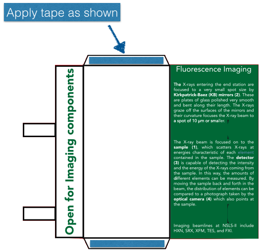

Build instructions
==================

Note: This is a craft project, not a simple "some assembly required" toy. Think about what you're doing as you make the book, and expect to have improvise a little at times. You may well think of a better way of doing some of these steps than what we've suggested. If so, let us know--maybe we'll incorporate it in to a new set of instructions!

# Preliminaries
## Step 1

Gather [materials](https://github.com/bruceravel/synchrotron_pop_up_book/blob/master/materials.md).

## Step 2

Download [pdf files](https://github.com/bruceravel/synchrotron_pop_up_book/blob/master/pages.md) for the individual pages.

## Step 3

Print. The inserts and front and back cover may be printed on regular paper if desired. Other components should be printed on tear-resistant paper or cardstock. 

Note: some of the pages have two sides, with one file for each side. It is impossible, with any ordinary kind of printer, to ensure perfect alignment when printing two-sided (we tried!). But you should try to get the alignment as good as you can. This usually involves putting a single sheet in the paper tray or feeder, pushed all the way up against the guides on one side (in most printers, there's a little wiggle room), printing one side, and then putting the printed page back in the paper tray/feeder, pushed up against the same guides, and printing the second side.

# Note on Cutting

At some point, you will need to cut out the components for the book, and also cut several slits in the pages. The red lines show you where to cut when it is not obvious.

One good way to make the cuts is to use a utility/hobby knife, or a razor blade. Scissors are not recommended--it's hard, for example, to cut the slits that way. If you have an automatic cutter of some kind, such as are sold for scrapbooking, you can download the [photoshop files](https://github.com/bruceravel/synchrotron_pop_up_book/blob/master/photoshop.md) and use the cut lines layer to create a template for your cutter.

If you are using a knife or razor blade, we recommend cutting as you go, rather than doing all the cutting first. The instructions below sometimes mention subtleties in how to make the cuts that you might miss otherwise, and it also becomes easy to confuse components such as the different sections of wall.

# Note on Tape

If you're using the suggested tape from the materials page, you don't need a scissors to cut off strips--you can tear it with your fingers.

# Components for Experiments

The first thing to assemble is the components for the experiments that will go in the endstation, and the pouches to hold them.

## Step 4

Each of the "pouches" sheet has a piece that will form a pouch when cut out and folded--they take up about half the page, and have "Open for...components" on the left flap. One is blue, one is red, and one is green. 

Cut around the outside of these shapes to remove them from their sheets.

## Step 5

Note that each pouch also has two tall narrow ovals, in black, inside the colored rectangle with the text. Cut a slit inside each of these ovals. It is not necessary for the slit to be perfect--you don't need to cut out the entire oval to its border, for example. It just needs to be wide enough to fit the tabs at the left side.

## Step 6

For each pouch, tear off two strips of tape about the length of the small trapezoidal tabs and apply them. For now, don't take the backing off.

## Step 7

For each pouch, fold away from you along the lines shown in purple below. This should create an envelope with the writing on the outside.

## Step 8

Remove the backing from the strips of tape, and seal the front of the pouch to the tabs.

You should now have three pouches. Each can be open and closed repeatedly by inserting the small rectangular tabs in to the slits you made.

## Step 9

Cut the individual cards out of the "Inserts" page. Slide each one in to the pouch with the massing label.

## Step 10

In the next several steps, we're going to make several of the experimental components that go in the pouches. Cut out the following:

* From the One-Sided Components page, the KB Mirrors and the Detector.
* From the Two-Sided Components page, the Silicon Drift Detector, the plant, the solar cell sample, the Optical Camera (labelled 4), and the Goniometer head (the small, grey, unlabeled piece in the lower left).
* From the page that held the imaging pouch, the Goniometer base (labelled b).
* From the Inner Wall page, the Cryostream.
* From the Spinner page, the Incident Detector and Transmission Detector.

## Step 11

Fold the tab on the plant toward you, ans slide the plant in to the green pouch. Fold the tab on the solar cell sample toward you, and slide in to the blue pouch.

## Step 12

The Cryostream and the Optical Camera have a diagonal line to mark where a slit should be. Cut each slit, extended it all the way to the edge.

The Cryostream can now be slid in to the red pouch and the Optical Camera in to the green pouch.

## Step 13

The KB Mirrors, the Detector, and the Silicon Drift Detector are assembled similarly. In each case, there is a small rectangle at one end, about the width of a strip of tape. Place a piece of tape along that length. Next, fold away from you along each of the parallel rectangle sides, so that the object forms a box, with the rectangle with the tape overlapping the bottom of the opposite side. Remove the backing from the tape and press against the overlapping side. Manipulate the resulting box so that the sides are perpendicular. Do not fold the tabs!

Slide the KB Mirrors and the Silicon Drift Detector in to the green pouch and the Detector in to the red pouch. You'll have to flatten them a bit to do that.

## Step 14

The Incident Detector and Transmission Detector are assembled similarly. Place a piece of tape in the empty rectangle as shown. Fold away from you along each line shown, to form a box. Remove the backing from the piece of tape and attach it to the overlapping side. Manipulate the resulting box so that the sides are perpendicular. Fold the tab so that it points out from the box.

Slide the Incident Detector and the Transmission Detector in to the blue pouch. You'll have to flatten them a bit to do that.

## Step 15

Place a piece of tape along the Goniometer head as shown. Then fold away from you along the line shown (the exact location of the fold isn't crucial).

Remove the backing from the tape and attach to the center of the Goniometer base. It doesn't matter which way you orient it, but you should manipulate the fold so that the goniometer head is sticking straight out of the base.

Place the assembled goniometer in to the red pouch.

## Step 16

Close each of the pouches by slipping the tabs in to the slits, and set aside.

# Bend Magnet Spinner

## Step 17

Cut out the remaining pieces from the Spinner page. The scalloped edges of the spinner are not crucial to its function; spend as much or as little effort as you'd like getting those cut prettily!

Note the red oval in the top bend magnet (shown in blue). Cut a slit in that red oval.

Note the red circles in the spinner. Find a way to make each in to a hole. Maybe you can do that with a knife or razor, or maybe it's better to use a needle--let us know what works well for you! (We used a laser cutter for all the cuts in the book, so haven't experimented much with other methods.) Do not make the holes bigger than the circles.

## Step 18

Thread an ordinary round toothpick through the spinner. Using the numbering shown on the figure below, start with the toothpick on the printed side of the spinner, and then push it through hole 1, back out hole 2, in hole 3, and so on. It should fit snugly. If it doesn't, tape or glue it in place, but don't use any tape or glue between hole 4 and hole 5.

## Step 19

Print Page 1. Note there is a small red circle in the lower left and a red oval a little right of the center. Make a hole through the circle, and cut a slit inside the oval.

## Step 20

Take one of the small screws, and pass it through hole S in the spinner and then through the hole in page 1 and in to a matching nut. Tighten enough to hold in place, but not so tight that the spinner can't be turned.

## Step 21

Take the X-ray arrow from the Spinner page, and apply a small piece of tape opposite the end with the arrowhead. Slip the arrow through the slit in the blue bend magnet (not the slit in Page 1!) so that the arrowhead is visible in front of the bend magnet and pointing to the right. Take the other end (which has tape on it, right?) and wrap it around the toothpick (which is threaded through the spinner) somewhere between hole 4 and 5. Remove the backing from the tape and attach the end of the arrow to itself, forming a small loop around the toothpick. The idea is that the arrow should be able to slide freely up and down the toothpick between holes 4 and 5.

You should now have a multi-layered assembly. From front to back, you should have the arrowhead, the bend magnets, the tail of the arrow (wrapped around the toothpick), the spinner, and then Page 1. 

## Step 22

Use tape to attach the piece with the bend magnets to Page 1. Because the spinner will be in the way of much of it, those tapes will be limited to a few places on the outer edges of the back of the piece with the bend magnets. In addition, don't use any tape in the top left quadrant except for one piece at the edge of the page, since the toothpick will need to be able to spin freely in that area. 

The result should be that you can turn the spinner using the window in the bend magnet piece at the left, and as you do so the x-ray arrow moves further in or out of the bend magnet. The toothpick should not be visible, and the range of rotation should be limited by a piece of tape so that the toothpick cannot be rotated in to the window.

There's all sorts of places where something could get stuck here--this is one of the places where it's handy to be able to remove the tape from the tear-free paper! Work at it until you're satisfied.

# Shaping Magnets

## Step 23

From the Magnets page, cut out the quadrupole magnet, the sextupole magnet, and the two magnet frames. The quadrupole magnet is the thing with the four copper coils, the sextupole the one with the six coils, and the frames are the colored octagons.

## Step 24

Put a small piece of tape on the end of each tab sticking out from the magnets, on the non-printed side of the paper.

## Step 25

For each magnet, fold it toward you along one of the purple lines shown below. Then unfold and fold toward you along the other purple line. Unfold again, and then fold away from you along the green line.

Fold the frames away from you along the green lines (i.e. fold them in half).

## Step 26

