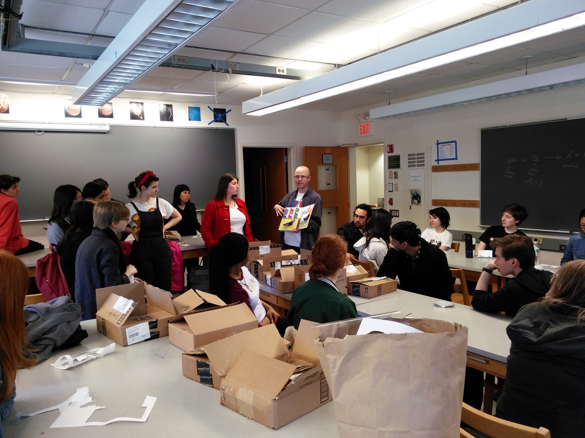

The construction team
=====================

The following students of Sarah Lawrence College were on the build
team for theconstruction of the first edition of the book.  With their
help we assembled almost 330 copies of the book.  What a great team!

Here's Scott demonstrating a prototype of the book to the group on the first day of construction.

 * Adelina Sun 
 * Andy Zou
 * Brennan Coulter
 * Caroline Kjellberg 
 * Catherine Mucci
 * Emmeline Kaser
 * Gabrielle Greiner
 * Jacqueline Muir
 * Jaime Chu 
 * Jasen Vita
 * Josephine Lenski
 * Joshua Sanguino 
 * Julia Langer
 * Keeratdeep Kaur
 * Lillian Rosner
 * Lily Huber 
 * Nia Itoh
 * Niayesh Jamshidi
 * Quiana Jones 
 * Rebecca Alpert
 * Rebecca Somogyi 
 * Sisi Liu
 * Soleil Groh
 * Sydney Leed
 * Tahmid Fahim Munat 
 * Taylor Plourde
 * Uday Keith
 * Viviana Almandsmith
 * Xueyi Bu 
 * Yanyao Zhou

We had help from a few other people as well

 * Blaine Alleluia, a Sarah Lawrence alumna who participated on the
   first day of construction
 * Neil Hyatt and Martin Stennett, two of Bruce's collaborators from
   University of Sheffield who were stuck at the NSLS without beam 
   over the second weekend of construction due to vacuum problems
 * Sue Wirick, Annie Heroux, and Mona Rowe who helped cross the
   construction finish line in time for the 2014 NSLS/NSLS-II/CFN
   annual Users' Meeting.
 
