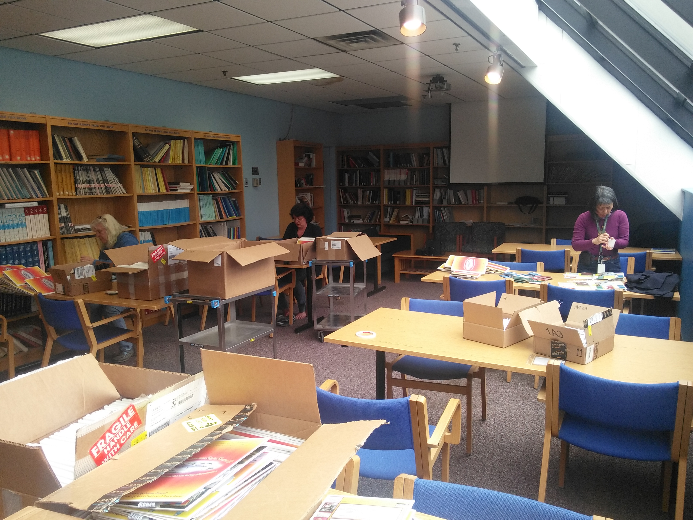
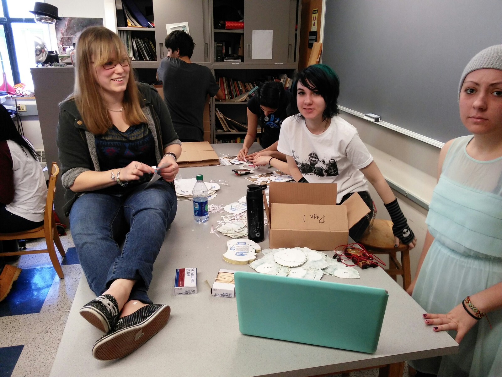
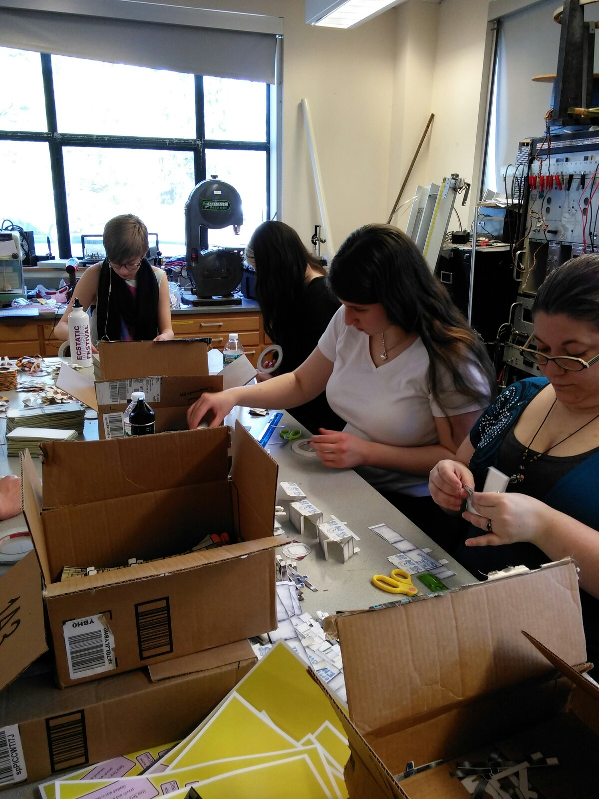
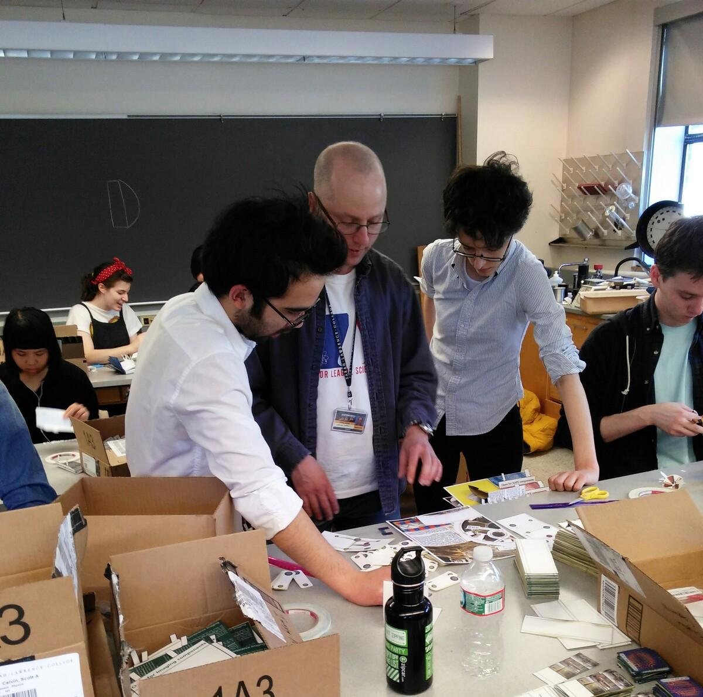
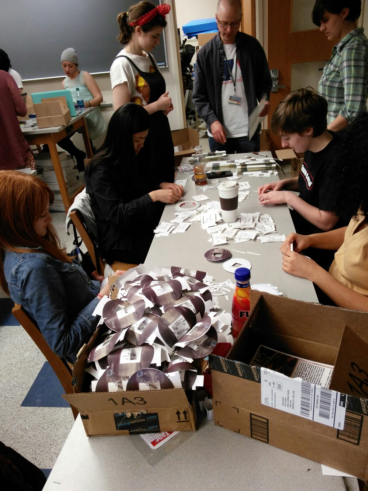
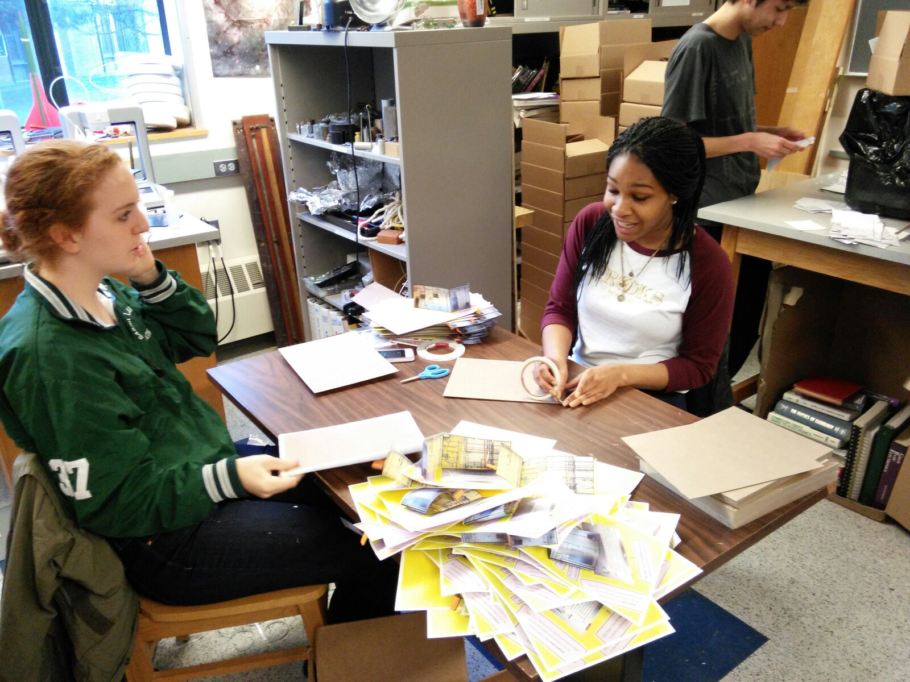
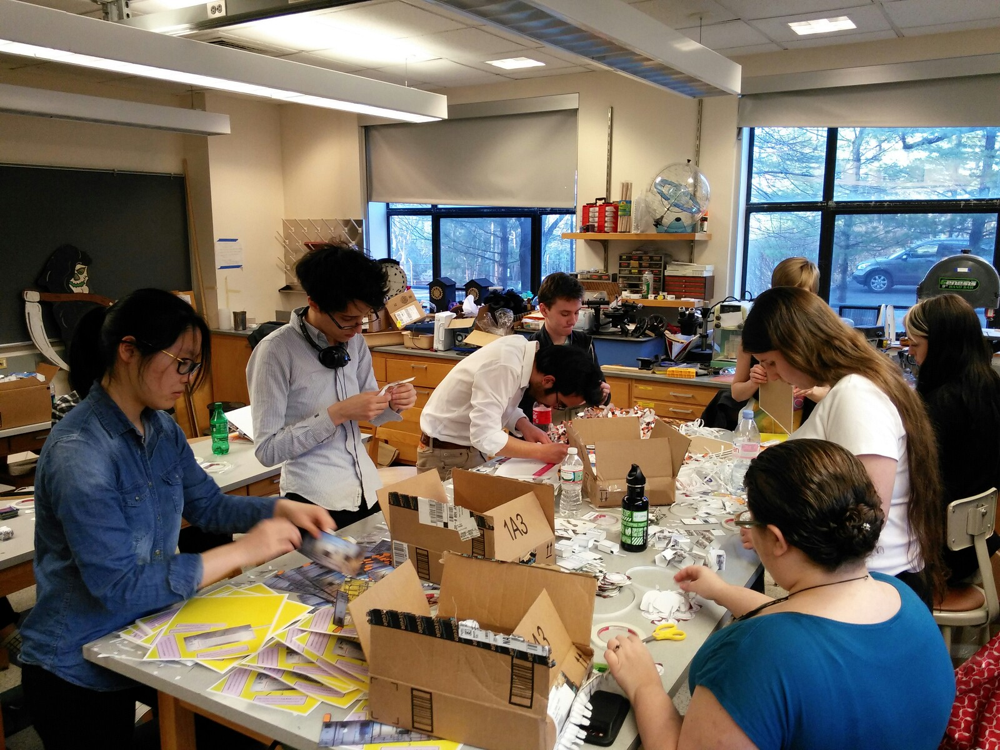
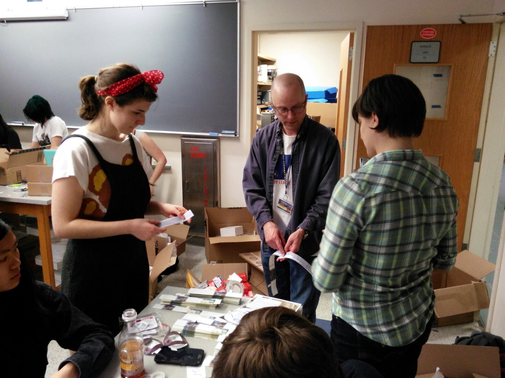

The construction team
=====================

The following students from Sarah Lawrence College were on the build
team for the construction of the first edition of the book.  With their
help we assembled almost 330 copies of the book.  What a great team!

Here's Scott demonstrating a prototype of the book to the group on the first day of construction.

 * Adelina Sun 
 * Blair Mason
 * Brennan Coulter
 * Brent Terry
 * Caroline Kjellberg 
 * Catherine Mucci
 * Emmeline Kaser
 * Gabrielle Greiner
 * Jacqueline Muir
 * Jaime Chu 
 * Jasen Vita
 * Joshua Sanguino 
 * Julia Langer
 * Katherine McGuire
 * Lily Huber 
 * Michelle Johnson
 * Nia Itoh
 * Niayesh Jamshidi
 * Quiana Jones 
 * Rebecca Alpert
 * Rebecca Somogyi 
 * Garnet Liu
 * Soleil Groh
 * Sydney Leed
 * Tahmid Fahim Munat 
 * Taylor Plourde
 * Uday Keith
 * Viviana Almandsmith
 * Xueyi Bu 
 * Yanyao Zhou

We had help from a few other people as well

 * Blaine Alleluia, a Sarah Lawrence alumna who participated on the
   first day of construction
 * Neil Hyatt and Martin Stennett, two of Bruce's collaborators from
   University of Sheffield who were stuck at the NSLS without beam 
   over the second weekend of construction due to vacuum problems
 * Sue Wirick, Annie Heroux, Mona Rowe, and Matt Cowan who helped
   cross the construction finish line in time for the 2014
   NSLS/NSLS-II/CFN annual Users' Meeting.
   
   
Here are Sue, Annie, and Mona hard at work!

## Photos from the first day of construction

Julia, Mucci, and Taylor assembling the bend magnet spinners.

----

Emmeline, Jacqueline, Lily, and Blaine assembling paper craft end station instruments.  These will be inserted into the pouches.

----

Scott conferring with Jasen and Caroline on the assembly of the papercraft undulator, one of the more complicated pieces in the book.

----

Gabrielle, Garnet, Rebecca, Blair, Vivi, and Nia assembling papercraft monochromators.

----

Rebecca and Quiana atteching page 3 to the chipboard backing.

----

Yanyao, Caroline, Jasen, Brennan, Emmeline, Jacqueline, Lily, and Blaine assemblling various parts of the book.

----

Scott teaching Rebecca and Blair how to assemble the ring walls.

