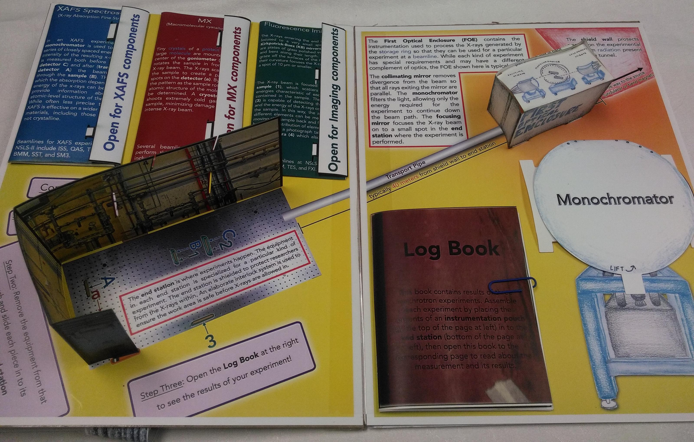
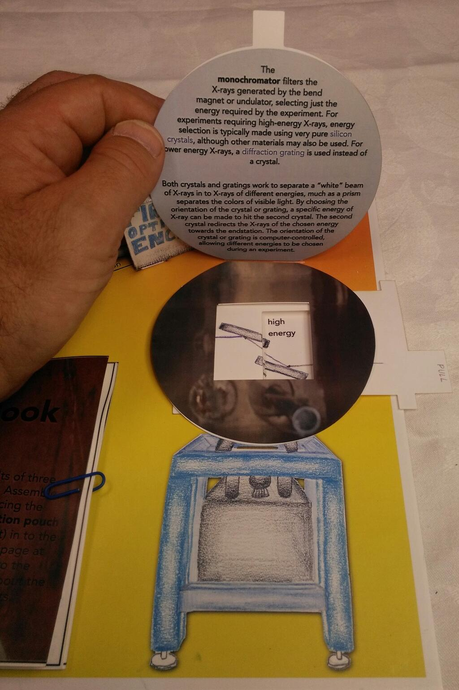
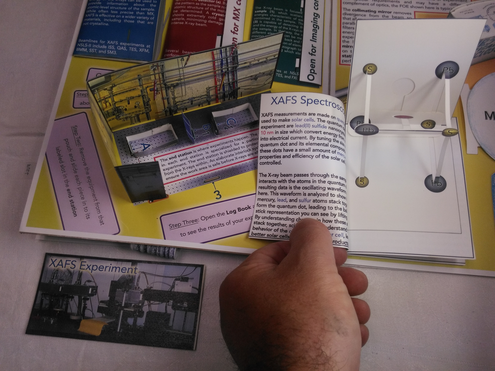
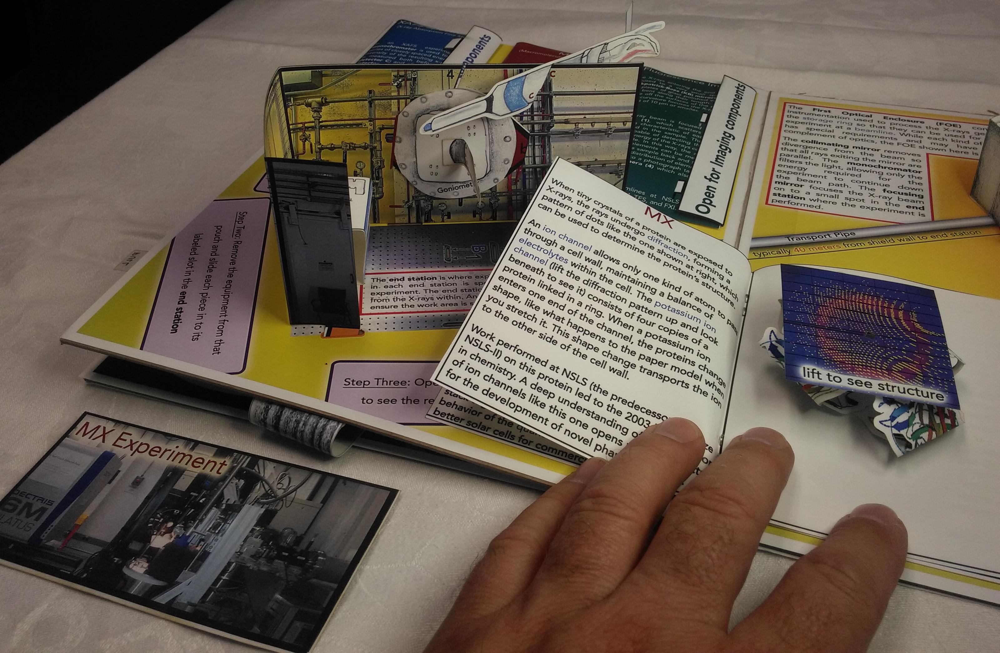

A quick walkthrough
===================

 
 

A pop-up book is meant to be played with.  This walkthrough only gives
a sense of what the book is and how fun it is for the reader.

# Ring spread

The first spread depicts the entire NSLS-II synchrotron.

The first thing you notice is the ring itself unfolding.  Be sure to
notive the that starts inside the ring and continues onto the interior
wall of the ring.  A synchrotron is an electron storage ring -- this
text explains where the electrons come from.

In the upper left corner is some text explaining how NSLS-II will
operate as a
[user facility](http://science.energy.gov/user-facilities/).  Below
that is a spinner which explains how X-rays are generated from the
electron current passing through a
[bend magnet](http://en.wikipedia.org/wiki/Dipole_magnet).

In the upper right corner is a booklet explaining how the
[quadrupole](http://en.wikipedia.org/wiki/Quadrupole_magnet) and
[sextupole](http://en.wikipedia.org/wiki/Sextupole_magnet) magnets
work to shape the electron beam, maintaining the small size required
for the world-leading performance of NSLS-II.

In the lower right corner is a pull tab explaining how undulators
gtenerate the extremely intense, laser-light beam of X-rays that make
NSLS-II a unique place to perform scientific measurements with X-rays.

# Beamline spread

The second spread depicts a typical beamline at NSLS-II.

In the lower right corner is an explanation of how a
[monochromator](http://en.wikipedia.org/wiki/Monochromator) is used to
select the X-ray energy to be used in an X-ray measurement.  Lift the
cover of the monochromator to read the explanation and pull the tab to
see the posuitions of the monochromator crystals for low and high
energy X-rays.

The three colored pouches in the upper left corner contain papercraft
representations of **end station** instrumentation.  You can build
your own synchrotron experiment!  Then open up the **log book** to the
corresponding page to see the results of an example of each of the
three measurement techniques.

## XAFS experiment

After reading about the
[XAFS technique](http://en.wikipedia.org/wiki/Xafs) on the cover of
the blue pouch, the XAFS experiment is built from the two
[ionization chambers](http://en.wikipedia.org/wiki/Ionization_chamber)
within the pouch with the sample placed between the two chambers.
Then the results of the XAFS experiment are shown in the **Log Book**
as a 3D ball-and-stick model of the crystal structure of the sample.
In this case, the structure of a material used in a quantum dot
[photovoltaic cell](http://en.wikipedia.org/wiki/Photovoltaic_cell).

## Macromolecular crystallography experiment

Next, on the red pouch you can read about the technique of
[macromolecular crystallography (also called MX)](http://en.wikipedia.org/wiki/Protein_crystallography#Biological_macromolecular_crystallography),
which is used to determine the structures of large molecules, such as
the
[potassium ion channel](http://en.wikipedia.org/wiki/Potassium_ion_channels)
depicted in the **Log Book**.  The
[goniometer](http://en.wikipedia.org/wiki/Goniometer) is used to
precisely position the sample relative to the incoming X-ray beam.
X-rays are scattered off the crystalline sample in many directions.
These scattered portions of the beam are measured as spots on the
X-ray camera.  A [cryocooler](http://en.wikipedia.org/wiki/Cryocooler)
blows very cold gas at the sample to keep it frozen in order to better
survive exposure to the intense X-ray beam.

## Imaging experiment

Finally, you can read about the [fluorescence imaging](http://en.wikipedia.org/wiki/X-ray_fluorescence) technique on the
green pouch.  Inside the pouch are the Kirkpatrick-Baez mirrors used
to focus the X-ray beam to a spot-size below
[10 micrometers](http://en.wikipedia.org/wiki/10_micrometers).  The
sample, the leaf of a plant in this example, is moved back and forth
in the beam.  Using the
[silicon drift detector](http://en.wikipedia.org/wiki/Silicon_drift_detector),
a map of the locations of different metal atoms in the leaf is found
and compared to a photograph of the leaf measured by the optical
camera.  In the **Log Book**, you will find a photo of the leaf and
overlays depicting the locations of the elements cobalt and calcium.

